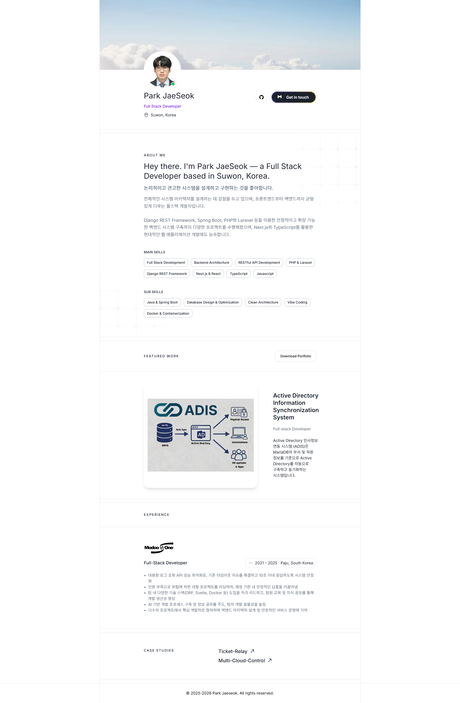

# My Portfolio

박재석의 개인 포트폴리오 웹사이트입니다. Full Stack Developer로서의 소개, 주요 기술 스택, 경력, 대표 프로젝트, 포트폴리오 PDF 다운로드와 연락처 접근을 한 페이지에서 확인할 수 있도록 구성했습니다.

## 주요 기능

- 프로필, 위치, GitHub 링크, 이메일 복사 기능을 포함한 히어로 섹션
- 소개와 주요 기술 스택 배지
- 대표 작업 소개: Active Directory Information Synchronization System
- 경력 정보와 주요 성과
- GitHub 프로젝트 링크: Ticket-Relay, Multi-Cloud-Control
- 포트폴리오 PDF 다운로드 버튼
- 반응형 레이아웃과 Next.js Image 최적화

## 기술 스택

- Framework: Next.js 16, React 19
- Language: TypeScript
- Styling: Tailwind CSS 4, shadcn/ui 기반 컴포넌트
- UI: Base UI, lucide-react, class-variance-authority
- Package Manager: pnpm
- Runtime: Node.js 24 Alpine 기반 Docker 개발 환경


## 포트폴리오 Preview
**Live Demo**  
[](https://my-portfolio-teal-three-70.vercel.app/)




## 시작하기

### 요구 사항

- Node.js 20 이상 권장
- pnpm

```bash
pnpm install
pnpm dev
```

개발 서버는 기본적으로 `http://localhost:3000`에서 실행됩니다.

### Turbopack 개발 서버

```bash
pnpm dev:turbo
```

### 프로덕션 빌드

```bash
pnpm build
pnpm start
```

## Docker 개발 환경

Docker Compose로 개발 서버를 실행할 수 있습니다.

```bash
docker compose up --build
```

컨테이너는 `3000` 포트를 노출하며, Windows + Docker 환경에서 파일 변경 감지를 안정적으로 하기 위해 polling 옵션을 사용합니다.

## 프로젝트 구조

```text
src/
  app/
    api/
      featured-work/       # 대표 작업 데이터 API
      page-data/           # 경력, 교육, 프로젝트 데이터 API
    components/
      home/                # 홈 화면 섹션 컴포넌트
      layout/              # Header, Footer
      divider/             # 섹션 구분선
    globals.css            # 전역 스타일과 Tailwind 테마
    layout.tsx             # 루트 레이아웃
    page.tsx               # 메인 페이지 구성
  components/
    ui/                    # 공통 UI 컴포넌트
  lib/
    utils.ts               # 유틸리티 함수
public/
  images/                  # 프로필, 배너, 아이콘, 프로젝트 이미지
```

## 데이터 수정 위치

- 대표 작업: `src/app/api/featured-work/route.ts`
- 경력 및 프로젝트 링크: `src/app/api/page-data/route.ts`
- 소개와 기술 스택: `src/app/components/home/about-me/index.tsx`
- 프로필, GitHub, 이메일: `src/app/components/home/hero-section/index.tsx`
- PDF 다운로드 파일명: `src/app/components/home/featured-work/index.tsx`

포트폴리오 PDF 파일은 `public` 디렉터리에 두고, 컴포넌트의 `fileName` 값과 파일명을 맞춰야 합니다.

## 사용 가능한 스크립트

```bash
pnpm dev        # Webpack 기반 개발 서버
pnpm dev:turbo  # Turbopack 기반 개발 서버
pnpm build      # 프로덕션 빌드
pnpm start      # 프로덕션 서버 실행
pnpm lint       # 린트 실행
```

## 라이선스

이 프로젝트는 MIT License를 따릅니다. 자세한 내용은 `LICENSE` 파일을 확인하세요.
